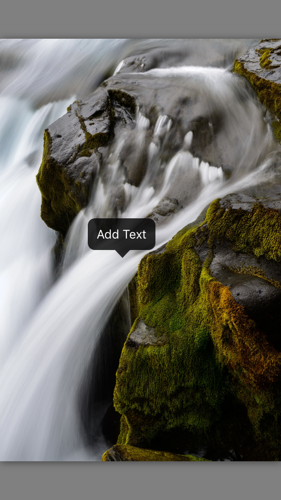
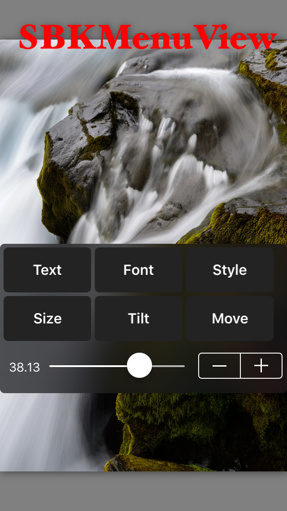

# SBKMenuView
inspired menu view from Phonto app

## Features

* Add text popup on SBKDisplayImageView

  

* Resize Text using SBKSliderVoew and SBKStepper

  

* SBKTextView custom UITextView created specially for this project with SBKTextViewObject ( to add text easily )

* SBKTextViewObject elements contains ( text, font, textColor )

## How to use 
	check the demo folder :)
	
App discontinued but it was a great experience to me.

feel free to improve it and send pull request :) 

of course it may have issue or the code style isn't good enough 

so please don't judge my code ( it was personal project and hadn't time to clean it )

hope it will be a good start for who need such menu in his application

### License

	Copyright (c) 2015 Mokhlas Hussein ( iMokhles )
	Dual licensed under the [Apache License 2.0](http://choosealicense.com/licenses/apache-2.0/) license.